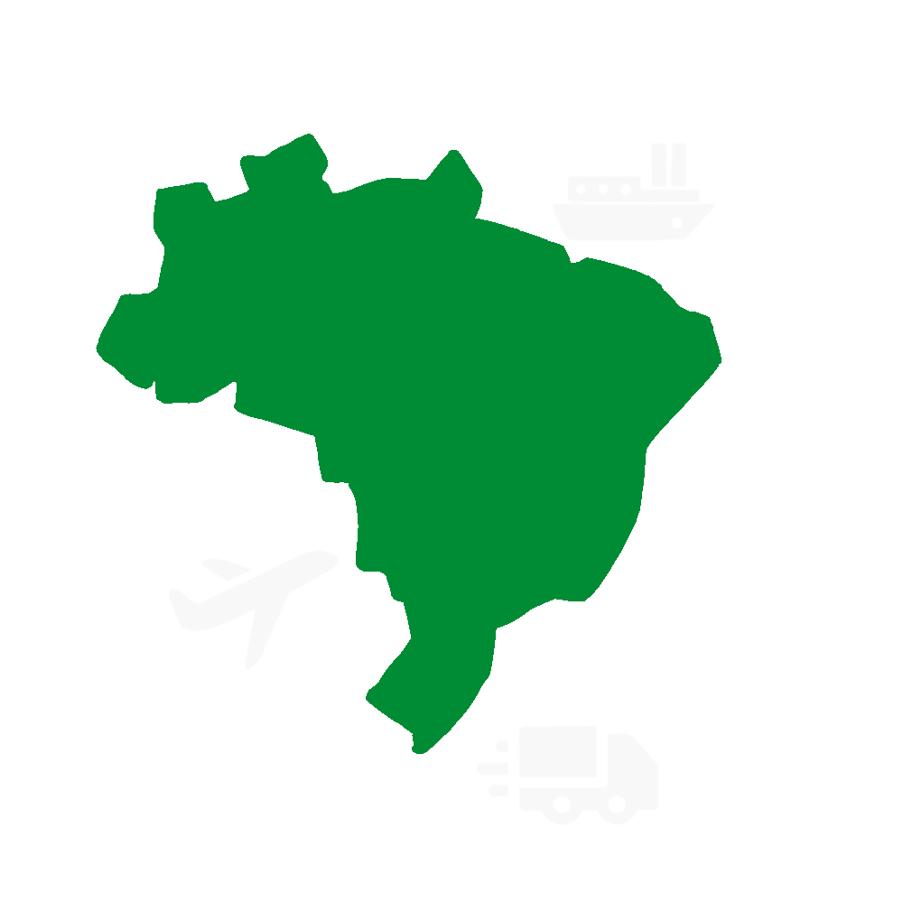
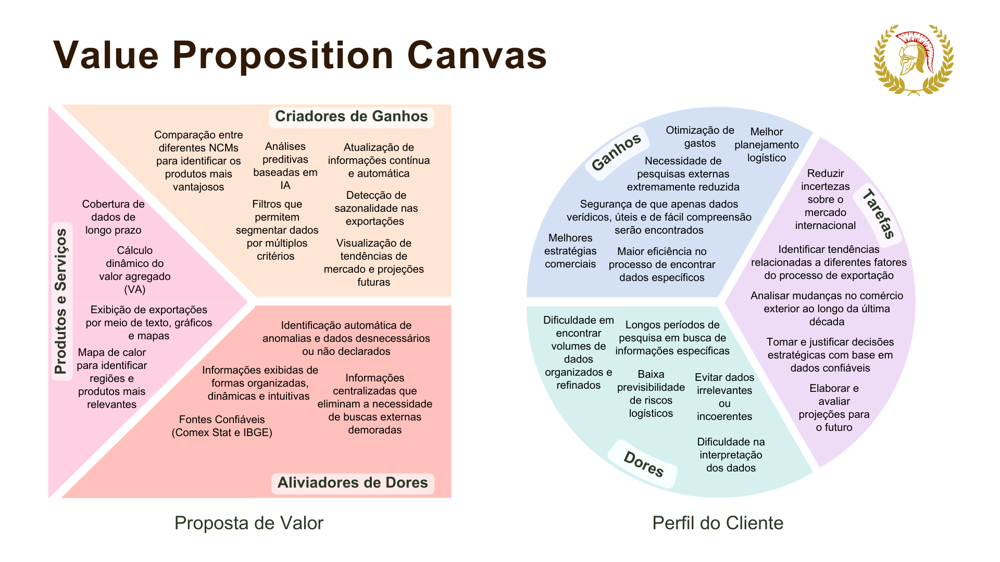
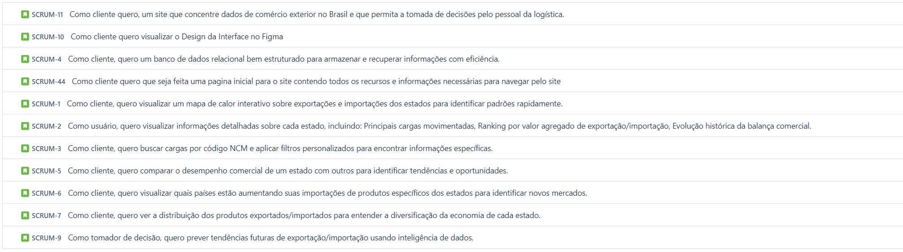

# InsightFlow
📦 Plataforma de Comércio Exterior do Brasil  

## 📖 Sobre o Projeto  
Este projeto visa concentrar dados de comércio exterior no Brasil, fornecendo informações essenciais para profissionais de logística e tomada de decisão.  
A plataforma oferecerá análises interativas, busca avançada e previsão de tendências para facilitar a compreensão do mercado.  

## 🎯 Objetivos Principais  
✅ Centralizar informações de importação e exportação do Brasil.  
✅ Apresentar gráficos interativos para identificação rápida de padrões.  
✅ Disponibilizar um painel detalhado com dados de cada estado.  
✅ Permitir busca e filtragem por código NCM e categorias personalizadas.  
✅ Comparar o desempenho comercial dos estados.  
✅ Identificar tendências e oportunidades de mercado com inteligência de dados.  

## 🚀 Funcionalidades do Produto  
- **Painel com Gráficos Interativos**: Visualização de exportações e importações por estado.  
- **Detalhamento por Estado**: Ranking de produtos, evolução histórica e balança comercial.  
- **Busca Avançada**: Filtros personalizados e pesquisa por código NCM.  
- **Comparação Comercial**: Análise do desempenho de um estado frente a outros.  
- **Identificação de Oportunidades**: Monitoramento de países que aumentam importações de produtos específicos.  
- **Previsão de Tendências**: Uso de inteligência de dados para projeções futuras.  

## 🛠️ Tecnologias Utilizadas
*Backend*

  
  
  
  

*Frontend*

  
  
  
  
  
  

*Auxiliares*

  
  
  
  
  

## ⚡ Desenvolvimento Ágil
O projeto foi feito seguindo o método Ágil SCRUM, dividindo o trabalho em sprints de 21 dias, com reuniões diáras, revisões e retrospectivas ao final. Essa abordagem permitiu uma gestão eficiente do projeto, com foco na entrega contínua de valor ao cliente. Ao longo das sprints, a equipe adquiriu e aprimorou habilidades técnicas e interpessoais, promovendo a resolução ágil de desafios e a adaptação a novas demandas.

## 📋 Backlog do Produto

## 🎨 Protótipo (Figma)  
https://www.figma.com/design/yA0OeKu4rlyvuD8anzKlYH/insightFlow?node-id=0-1&t=Ae5HxVAYWcSI4RzY-1

## 📅 Cronograma
| Sprint            | Prazo      | Status    |
| ----------------- | ---------- | --------- |
| Kick Off          | 28/02/2025 | Concluído |
| Sprint 1          | 31/03/2025 | Concluído |
| Sprint 2          | 28/04/2025 |  Pendente |
| Sprint 3          | 05/05/2025 |  Pendente |
| Feira de Soluções | 29/05/2025 | Pendente  |

## 🥇 Equipe

|      Membro      |    Função     |                            Github                            |
| :--------------: | :-----------: | :----------------------------------------------------------: |
| Agatha Wei | Product Owner |  |
| Julia Santiago | Scrum Master |  |
| Eduardo Ribeiro | Dev Team |  |
| Guilherme Henrique | Dev Team |  |
| Julia Soares | Dev Team |  |
| Karina Ribeiro | Dev Team |  |
| Pedro Garcia | Dev Team  |  |
